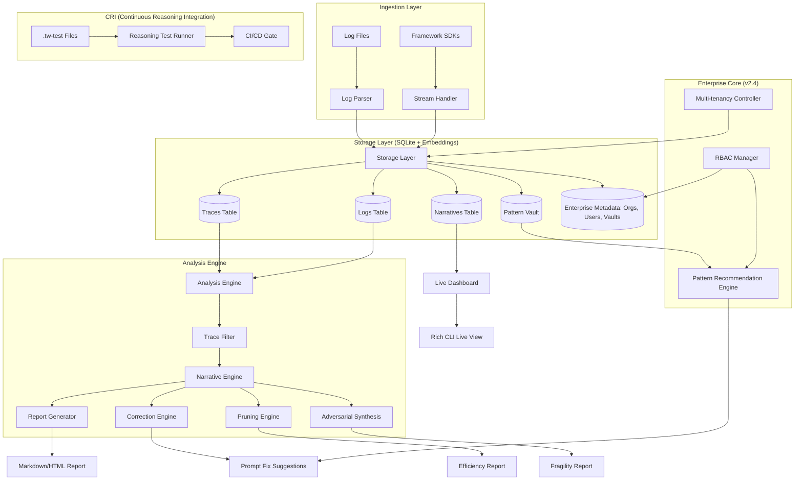

# Technical Architecture: TraceWhisper

## 1. Architecture Overview
TraceWhisper has evolved from a static post-mortem analysis tool (v1) into a proactive observability and corrective ecosystem (v2.2), an Intelligence Layer (v2.3), and now an Enterprise Reasoning Governance Platform (v2.4). 

### Data Flow Versions

#### v1: Batch Pipeline (Post-Mortem)
`Raw Log File` $\\\\rightarrow$ `Log Parser` $\\\\rightarrow$ `Trace Filter` $\\\\rightarrow$ `Narrative Engine` $\\\\rightarrow$ `Report Generator` $\\\\rightarrow$ `Final Report`

#### v2: Integrated Ecosystem (Proactive)
`SDK/Live Stream` $\\\\rightarrow$ `Storage Layer (SQLite)` $\\\\rightarrow$ `Live Whisper / Analysis Engine` $\\\\rightarrow$ `Real-time Dashboard / Reports`

#### v2.2: Closed-Loop Correction (Corrective)
`Analysis Engine (Detection)` $\\\\rightarrow$ `Correction Engine (Meta-Prompt)` $\\\\rightarrow$ `Suggested Prompt Adjustment` $\\\\rightarrow$ `User Application` $\\\\rightarrow$ `Updated Agent Prompt`

#### v2.3: Intelligence Layer (Optimization & Prevention)
`Pattern Vault` $\\\\rightarrow$ `Cross-Project Fix Recommendations`
`CRI (Continuous Reasoning Integration)` $\\\\rightarrow$ `Reasoning Unit Tests` $\\\\rightarrow$ `CI/CD Gate`
`Pruning Engine` $\\\\rightarrow$ `Cognitive Bloat Detection` $\\\\rightarrow$ `Token Optimization`
`Adversarial Synthesis` $\\\\rightarrow$ `Synthetic Stress Tests` $\\\\rightarrow$ `Fragility Analysis`

#### v2.4: Enterprise Governance (Scale & Control)
`Multi-tenancy` $\\\\rightarrow$ `Organizational Data Isolation`
`RBAC` $\\\\rightarrow$ `Permissioned Access to Vaults & Governance`
`Hierarchical Vaults` $\\\\rightarrow$ `Global $\\\\rightarrow$ Dept $\\\\rightarrow$ Team $\\\\rightarrow$ Private Inheritance`
`Golden Paths` $\\\\rightarrow$ `Cognitive SOPs & Compliance Scanning`

## 2. System Diagram

## 3. Data Model
We use Pydantic models for type safety and SQLite for persistence.

### 3.1 Core Models
- `RawLogEntry`: Single log line (timestamp, trace_id, level, component, content, metadata).
- `ProcessedTrace`: Chronological collection of `RawLogEntry` objects grouped by `trace_id`.
- `ExecutionReport`: Final structured object containing summary, narrative segments, tool usage, and failure analysis.
- `PromptFix`: Structured suggestion for prompt modification (analysis, suggested_modification, rationale, confidence_score).

### 3.2 Intelligence Models (v2.3)
- `ReasoningPattern`: A pair of `FailurePattern` $\\\\rightarrow$ `Correction` with associated embeddings for similarity search.
- `ReasoningTest`: A test case consisting of `Input` $\\\\rightarrow$ `Expected Cognitive Path` $\\\\rightarrow$ `Expected Output`.
- `PruningReport`: Analysis of cognitive bloat, identifying redundant steps and suggesting token reductions.
- `FragilityReport`: Summary of failure modes triggered by adversarial inputs.

### 3.3 Enterprise Models (v2.4)
- `Organization`: Top-level entity for data isolation.
- `User`: Identity with an associated `Role` (`Org Admin`, `Team Lead`, `Engineer`, `Auditor`).
- `Vault`: A permissioned container for `ReasoningPatterns` with a `parent_vault_id` for hierarchy.

### 3.4 Storage Schema (v2.4)
- **Organizations**: `id`, `name`, `created_at`.
- **Users**: `id`, `org_id`, `username`, `role`, `created_at`.
- **Vaults**: `id`, `org_id`, `name`, `parent_vault_id`, `created_at`.
- **Traces**: High-level metadata (`id`, `org_id`, `agent_id`, `session_id`, `start_time`, `end_time`, `metadata`, `status`).
- **Logs**: Individual entries (`id`, `trace_id`, `timestamp`, `level`, `message`, `raw_payload`, `step_index`).
- **Narratives**: Synthesized segments (`id`, `trace_id`, `step_range`, `content`, `timestamp`).
- **PatternVault**: Store of proven fixes (`id`, `vault_id`, `failure_embedding`, `failure_description`, `correction_prompt`, `success_rate`).

## 4. Component Specifications

### 4.1 Log Parser & Stream Handler
- **Parser**: Reads static files and deserializes them into `RawLogEntry` objects.
- **Stream Handler**: Provides an SDK (LangChain/CrewAI callbacks) to stream logs directly to the storage layer in real-time.

### 4.2 Storage Layer (`src/storage.py`)
- **Responsibility**: Manages the SQLite database and embedding storage.
- **Key APIs**: `save_trace()`, `append_log()`, `save_narrative()`, `get_trace_logs()`, `save_pattern()`, `query_patterns()`, `create_organization()`, `create_vault()`.

### 4.3 Narrative Engine (`src/engine.py`)
- **Responsibility**: 
  - **Batch Mode**: Processes a full trace to generate a report.
  - **Live Mode**: Processes sliding windows of logs to update a rolling narrative.
- **Interface**: `synthesize_narrative(trace: ProcessedTrace) -> ExecutionReport`.

### 4.4 Correction Engine (`src/correction_engine.py`)
- **Responsibility**: Implements the \\"Fix-It\\" logic. It uses a Meta-Prompt to analyze detected reasoning failures (Loops, Contradictions) and suggests precise system prompt modifications.
- **Interface**: `suggest_fix(system_prompt, trace, failure_type) -> PromptFix`.

### 4.5 Pruning Engine (`src/pruning_engine.py`)
- **Responsibility**: Detects \\"Cognitive Bloat\\" (circular reasoning, redundancy) and suggests prompt optimizations to reduce token usage.
- **Interface**: `analyze_efficiency(trace: ProcessedTrace) -> PruningReport`.

### 4.6 Pattern Vault (`src/pattern_vault.py`)
- **Responsibility**: Manages the library of failure-correction pairs. Uses embeddings and hierarchical lookups to recommend fixes based on current trace failures.
- **Interface**: `extract_pattern(trace, fix) -> ReasoningPattern`, `recommend_fix(trace, vault_id) -> List[ReasoningPattern]`.

### 4.7 Enterprise Core (`src/enterprise_core.py`)
- **Responsibility**: Implements the security and isolation layer for v2.4.
- **Key Components**:
  - `EnterpriseContext`: Manages current user/org session.
  - `RBACManager`: Enforces role-based permissions via a defined hierarchy.
  - `VaultAccessController`: Validates access to specific vaults based on user role and ownership.

### 4.8 CRI Runner (`src/reasoning_tests.py`)
- **Responsibility**: Executes reasoning unit tests and validates the cognitive path against expectations.
- **Interface**: `run_tests(prompt, test_suite) -> TestResult`.

### 4.9 Adversarial Synthesis (`src/adversarial_synthesis.py`)
- **Responsibility**: Generates synthetic stress tests to probe for reasoning fragility.
- **Interface**: `generate_stress_tests(prompt) -> List[TestInput]`.

### 4.10 Live Whisper (`src/live.py`)
- **Responsibility**: Tailing logs (via file or DB) and triggering the Narrative Engine upon \\"Key Decision Points\\" (KDPs).
- **UI**: Uses `rich` for a split-screen CLI dashboard.

## 5. Deployment & Stack
- **Language**: Python 3.11+
- **Persistence**: SQLite (Embedded)
- **Embeddings**: Sentence-Transformers or OpenAI embeddings
- **LLM Interface**: LiteLLM (supporting OpenAI, Anthropic, etc.)
- **UI**: Rich (CLI)
- **Dependency Management**: `uv`
