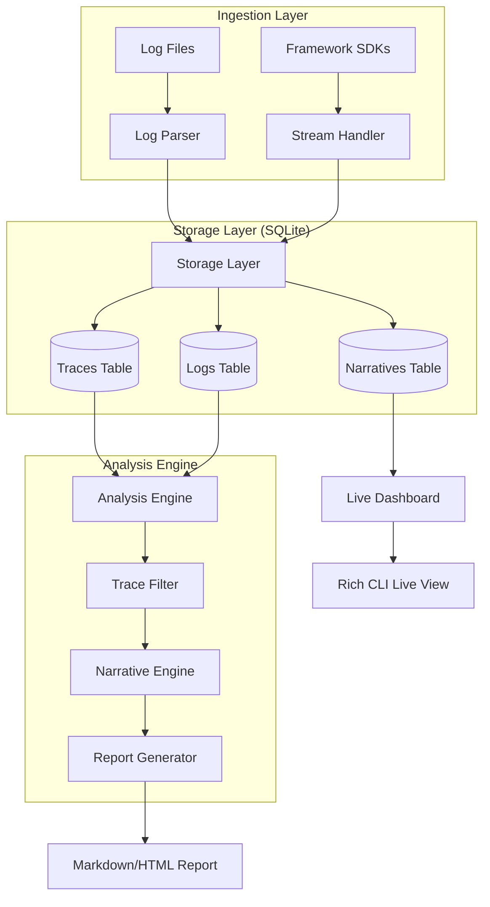

# Technical Architecture: TraceWhisper

## 1. Architecture Overview
TraceWhisper has evolved from a static post-mortem analysis tool (v1) into a proactive observability ecosystem (v2). The architecture now supports both asynchronous batch processing and real-time streaming.

### Data Flow Versions

#### v1: Batch Pipeline (Post-Mortem)
`Raw Log File` $\rightarrow$ `Log Parser` $\rightarrow$ `Trace Filter` $\rightarrow$ `Narrative Engine` $\rightarrow$ `Report Generator` $\rightarrow$ `Final Report`

#### v2: Integrated Ecosystem (Proactive)
`SDK/Live Stream` $\rightarrow$ `Storage Layer (SQLite)` $\rightarrow$ `Live Whisper / Analysis Engine` $\rightarrow$ `Real-time Dashboard / Reports`

## 2. System Diagram

## 3. Data Model
We use Pydantic models for type safety and SQLite for persistence.

### 3.1 Core Models
- `RawLogEntry`: Single log line (timestamp, trace_id, level, component, content, metadata).
- `ProcessedTrace`: Chronological collection of `RawLogEntry` objects grouped by `trace_id`.
- `ExecutionReport`: Final structured object containing summary, narrative segments, tool usage, and failure analysis.

### 3.2 Storage Schema (v2)
- **Traces**: High-level metadata (`id`, `agent_id`, `session_id`, `start_time`, `end_time`, `metadata`, `status`).
- **Logs**: Individual entries (`id`, `trace_id`, `timestamp`, `level`, `message`, `raw_payload`, `step_index`).
- **Narratives**: Synthesized segments (`id`, `trace_id`, `step_range`, `content`, `timestamp`).

## 4. Component Specifications

### 4.1 Log Parser & Stream Handler
- **Parser**: Reads static files and deserializes them into `RawLogEntry` objects.
- **Stream Handler**: Provides an SDK (LangChain/CrewAI callbacks) to stream logs directly to the storage layer in real-time.

### 4.2 Storage Layer (`src/storage.py`)
- **Responsibility**: Manages the SQLite database.
- **Key APIs**: `save_trace()`, `append_log()`, `save_narrative()`, `get_trace_logs()`.

### 4.3 Narrative Engine
- **Responsibility**: 
  - **Batch Mode**: Processes a full trace to generate a report.
  - **Live Mode**: Processes sliding windows of logs to update a rolling narrative.
- **Interface**: `synthesize_narrative(trace: ProcessedTrace) -> ExecutionReport`.

### 4.4 Live Whisper (`src/live.py`)
- **Responsibility**: Tailing logs (via file or DB) and triggering the Narrative Engine upon "Key Decision Points" (KDPs).
- **UI**: Uses `rich` for a split-screen CLI dashboard.

## 5. Deployment & Stack
- **Language**: Python 3.11+
- **Persistence**: SQLite (Embedded)
- **LLM Interface**: LiteLLM (supporting OpenAI, Anthropic, etc.)
- **UI**: Rich (CLI)
- **Dependency Management**: `uv`
