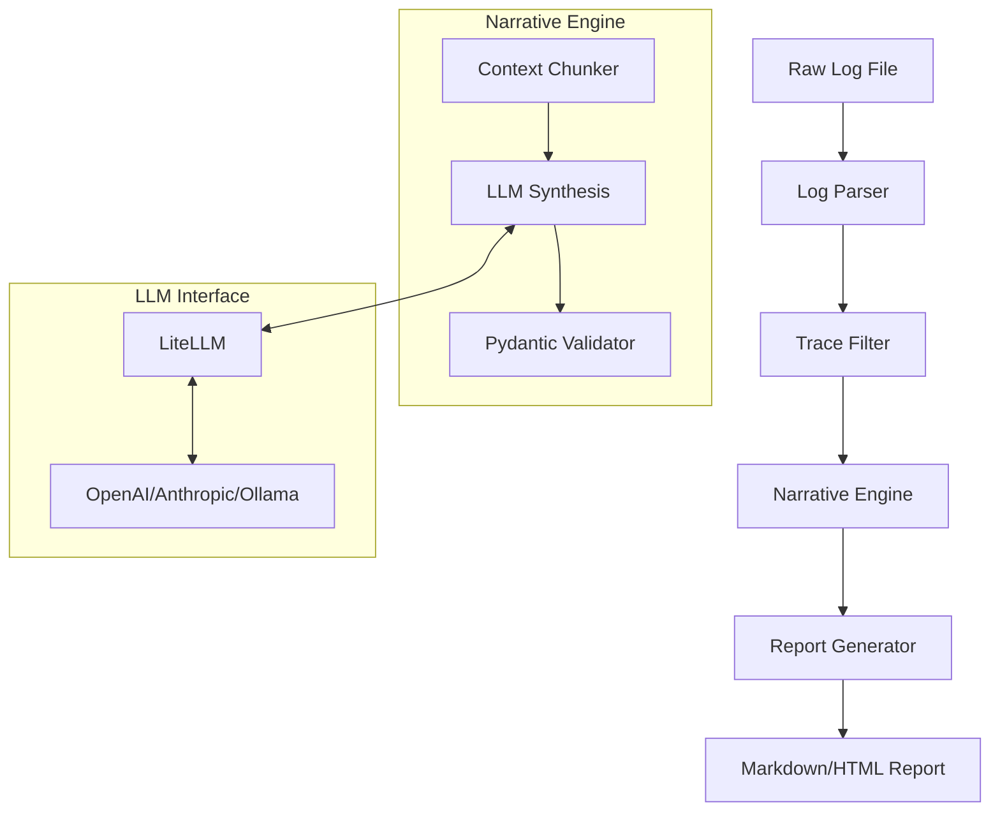

# Technical Architecture: TraceWhisper

## 1. Architecture Overview
TraceWhisper follows a **Pipe-and-Filter architecture**. Raw log data flows through a series of transformation stages, moving from high-volume noise to a high-signal narrative report.

### Data Flow Pipeline
`Raw Log File` $\rightarrow$ `Log Parser` $\rightarrow$ `Trace Filter` $\rightarrow$ `Narrative Engine` $\rightarrow$ `Report Generator` $\rightarrow$ `Final Report`

## 2. System Diagram

## 3. Data Model
We use Pydantic models to ensure type safety and data integrity across the pipeline.

### 3.1 Log Ingestion Model
- `RawLogEntry`: Represents a single line of log.
  - `timestamp`: datetime
  - `trace_id`: str
  - `level`: str (INFO, ERROR, DEBUG)
  - `component`: str (Thought, Action, Observation)
  - `content`: str
  - `metadata`: dict

### 3.2 Processing Model
- `ProcessedTrace`: A collection of `RawLogEntry` objects grouped by `trace_id`, sorted chronologically.
- `KeyDecisionPoint (KDP)`: A subset of the trace identified as a critical pivot in the agent's reasoning.

### 3.3 Output Model
- `ExecutionReport`: The final structured object.
  - `summary`: str (Executive Summary)
  - `narrative`: List[NarrativeSegment]
  - `tool_usage`: List[ToolSummary]
  - `failure_analysis`: Optional[str]

## 4. Component Specifications

### 4.1 Log Parser
- **Responsibility:** Read files from disk, handle encoding, and deserialize JSON/Text into `RawLogEntry` objects.
- **Interface:** `parse_logs(file_path: Path) -> List[RawLogEntry]`

### 4.2 Trace Filter
- **Responsibility:** 
  - Group entries by `trace_id`.
  - Remove "noise" (heartbeats, repetitive system prompts).
  - Identify KDPs based on patterns (e.g., "Error encountered", "Changing strategy to...").
- **Interface:** `filter_trace(entries: List[RawLogEntry]) -> ProcessedTrace`

### 4.3 Narrative Engine
- **Responsibility:** 
  - Chunk `ProcessedTrace` to fit LLM context windows.
  - Prompt the LLM to synthesize a narrative focusing on the *why* and *how*.
  - Validate LLM output against the `ExecutionReport` schema.
- **Interface:** `synthesize_narrative(trace: ProcessedTrace) -> ExecutionReport`

### 4.4 Report Generator
- **Responsibility:** Map the `ExecutionReport` object into a human-readable format using Jinja2 templates.
- **Interface:** `generate_file(report: ExecutionReport, format: Format) -> Path`

## 5. Deployment Strategy
- **Distribution:** The tool will be distributed as a Python package.
- **Execution:** Local CLI execution.
- **Configuration:** API keys and model preferences will be managed via environment variables or a `.env` file.
- **Dependency Management:** Managed via `uv` for fast, reproducible environments.
