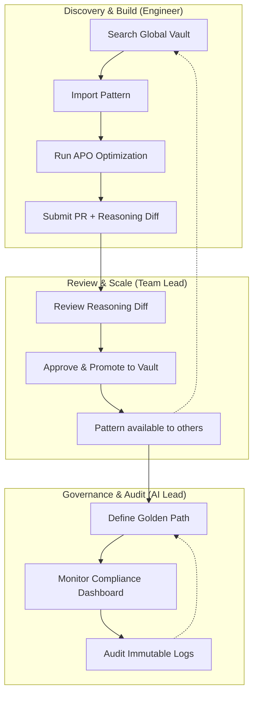

# v2.4 Enterprise Demo Script & User Journey

## 1. The Narrative Arc: "From Silos to Shared Intelligence"

**The Core Problem:** The "Prompt Engineering Ceiling." In most enterprises, AI intelligence is fragmented. Every team is reinventing the wheel, solving the same reasoning failures in isolation. When a prompt changes, the "why" is lost in a commit message, and governance is just a checklist that no one actually follows.

**The Solution:** TraceWhisper v2.4 transforms reasoning from a hidden byproduct of prompt engineering into a **governed corporate asset**. 

**The Demo Goal:** Move the viewer from the frustration of "silos of expertise" to the confidence of "organizational governance."

---

## 2. User Persona Journeys

### A. The Senior AI Engineer (The Power User)
**Goal:** Ship a high-performing agent without spending a week on manual prompt tuning.
*   **Journey:** 
    1.  **Discovery:** Searches the `Global-Org-Vault` for a proven "Complex Data Extraction" pattern.
    2.  **Implementation:** Imports the pattern into their local agent.
    3.  **Optimization:** Runs **APO (Autonomous Prompt Optimization)** to reduce token cost by 15% while maintaining accuracy.
    4.  **Submission:** Submits a PR. The system automatically attaches a **Reasoning Diff**, showing exactly how the cognitive path changed.

### B. The Team Lead (The Quality Gate)
**Goal:** Ensure high quality and prevent the team from drifting into "fragile" prompt territory.
*   **Journey:** 
    1.  **Review:** Opens the PR. Instead of guessing what the prompt change does, they analyze the **Reasoning Diff** (Visual Before vs. After).
    2.  **Validation:** Confirms the new reasoning path is more robust.
    3.  **Promotion:** Marks the fix as "Team Approved" and promotes it to the `Dept-Vault` so other teams can benefit.

### C. The Enterprise AI Lead (The Governor)
**Goal:** Manage risk, ensure compliance, and track ROI across the entire AI fleet.
*   **Journey:** 
    1.  **Definition:** Defines the **"Golden Path"** for PII handling (e.g., `Input` $\rightarrow$ `PII Scrub` $\rightarrow$ `Reasoning` $\rightarrow$ `Output`).
    2.  **Monitoring:** Checks the **Compliance Dashboard** to see which agents are deviating from the Golden Path.
    3.  **Audit:** Reviews the immutable audit log to see who changed a global reasoning pattern and the trace that justified it.

---

## 3. The Demo Script

### Scene 1: The Hook (The Pain)
**(Visual: A slide showing 5 different teams, each with a 'Prompt_v3_final_FINAL.txt' file)**
**Speaker:** "Right now, your AI intelligence is trapped in silos. Your best engineers are solving the same reasoning bugs over and over because there's no way to share *how* a prompt actually thinks. This is the Prompt Engineering Ceiling. Today, we break it."

### Scene 2: The Shared Brain (The Vaults)
**(Visual: Screen share of the TraceWhisper UI - Vault Hierarchy: Global $\rightarrow$ Dept $\rightarrow$ Team)**
**Speaker:** "Meet the Centralized Vaults. This isn't just a library of prompts; it's a library of *reasoning*. When a Senior Engineer starts a new project, they don't start from scratch. They search the Global Vault for a verified pattern—like this 'Financial Analysis' pattern—and import it instantly."

### Scene 3: The "Aha!" Moment (Reasoning Diff)
**(Visual: A GitHub PR interface. Beside the code change is a TraceWhisper 'Reasoning Diff' widget showing two side-by-side cognitive paths)**
**Speaker:** "The biggest friction in AI development is the PR. Usually, a reviewer sees a changed string and has to guess if it's better. Not anymore. Look at this **Reasoning Diff**. We can see exactly where the agent stopped hallucinating and started verifying. The reviewer isn't just approving code; they are approving a cognitive improvement."

### Scene 4: The Guardrails (Golden Paths)
**(Visual: The Compliance Dashboard. A list of agents with Green/Red status indicators)**
**Speaker:** "For the AI Lead, the goal is safety at scale. We define **Golden Paths**—the mandatory reasoning steps every agent must follow. If an agent deviates from the path, it's flagged here in the Compliance Dashboard. You move from 'hoping it works' to 'knowing it's compliant'."

### Scene 5: The ROI (APO)
**(Visual: A 'Before' and 'After' token cost graph)**
**Speaker:** "Finally, we automate the toil. With Autonomous Prompt Optimization, TraceWhisper identifies bottlenecks and proposes leaner reasoning paths. We're not just making agents smarter; we're slashing token waste across the entire enterprise."

---

## 4. Visual User Journey Map

**Journey Summary:**
`Siloed Effort` $\rightarrow$ `Shared Pattern` $\rightarrow$ `Verified Change` $\rightarrow$ `Organizational Standard` $\rightarrow$ `Governed Intelligence`.
